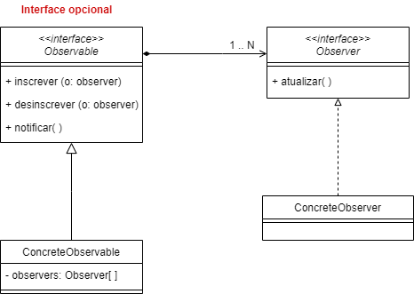

# Padrão Observer

## Centro Universitário UNIESP

### Professora: Drª Alana Morais ([alanamm.prof@gmail.com](mailto:alanamm.prof@gmail.com))

### Aluno: Iria Guazzi Linden ([iria.guazzi@hotmail.com](mailto:iria.guazzi@hotmail.com))

## Nome

Observer, também conhecido como *Dependents* e *Publish-Subscribe*, é um padrão comportamental onde se define uma dependência “um para muitos” entre objetos, modo que, quando um objeto muda de estado, todos os seus dependentes são automaticamente notificados e atualizados.

Existem dois tipos de objetos: objetos observadores [Observer] e objetos observados (ou observáveis) [Observable];

O Observable alerta os objetos que o observam sempre que sofre mudança.

## Problema

Surge a necessidade de utilizar o observer quando o sistema possui várias entidades  interessadas em qualquer atualização possível para algum segundo objeto em particular.

Como acoplar esses objetos sem que se conheçam (independentes) e, ainda, criar e desfazer o acoplamento a qualquer momento?

## Solução

Será criada a classe Observable. Assim, todos os observadores se registram para serem notificados sobre qualquer atualização posterior no estado do Observable.

Assim que o estado do observable muda, ele notifica todos os observadores registrados e os observadores podem acessar o estado atualizado e agir de acordo.

## Consequências
**Vantagens:**
 - O padrão Observer garante uma separação clara entre o sujeito (Observable) e os objetos observadores (são independentes);

 - Comunicação tipo broadcast: a notificação é enviada automaticamente para todos os objetos interessados;

 - Um objeto observador pode se registrar ou cancelar o registro do sujeito a qualquer momento. Isso ajuda a tornar os objetos objetos fracamente acoplados.
 
**Desvantagens:**
 - Pode ser complexo ou impossível manter a ordem  que as notificações são enviadas.

 - Caso existam muitos observadores, a mudança de estado do Observable pode ter um alto custo na performance do sistema.

 - Atualizações inesperadas podem fazer com que os observers não tenham detalhes do que mudou, gerando dificuldades para descobrir a mudança
